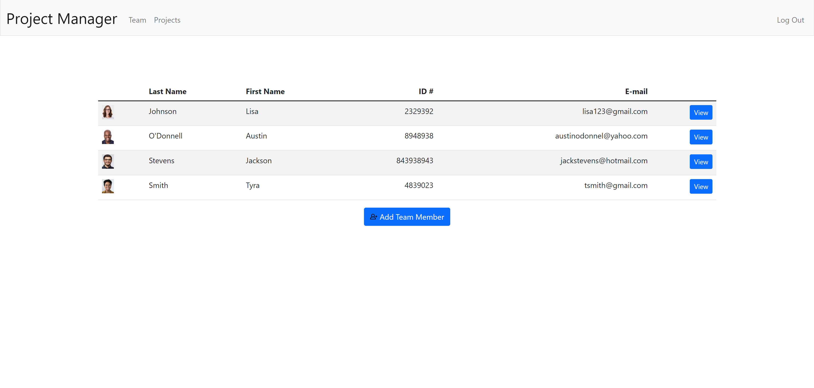

# Project Manager

https://imran-project-manager.herokuapp.com/

## Description
This web app allows a user to manage a team and any projects that the team is assigned. The user can add people to their team, as well as create projects that the team can work on. Each project can have different members of the team assigned to it.

  

## Run on Local Machine
From main directory:
`pip install -r requirements.txt`

Then run:
`python -m flask run`
